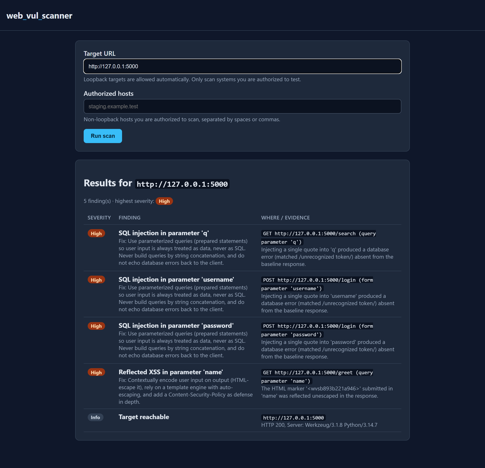
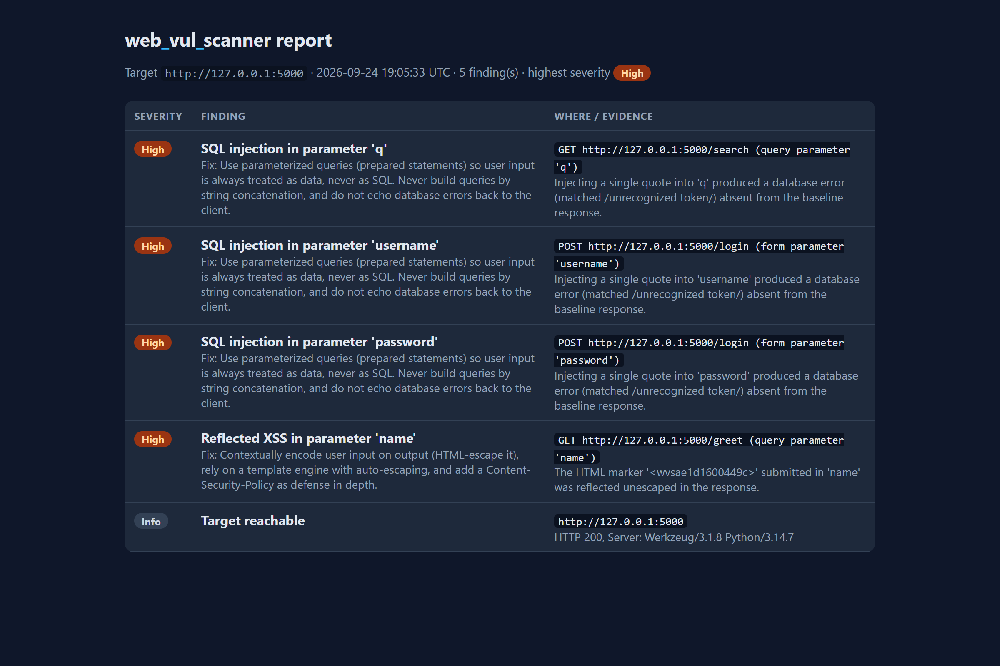
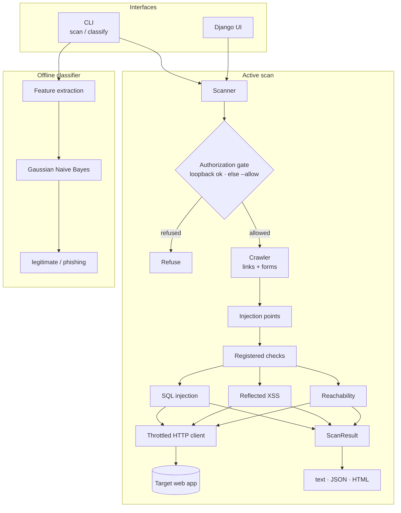
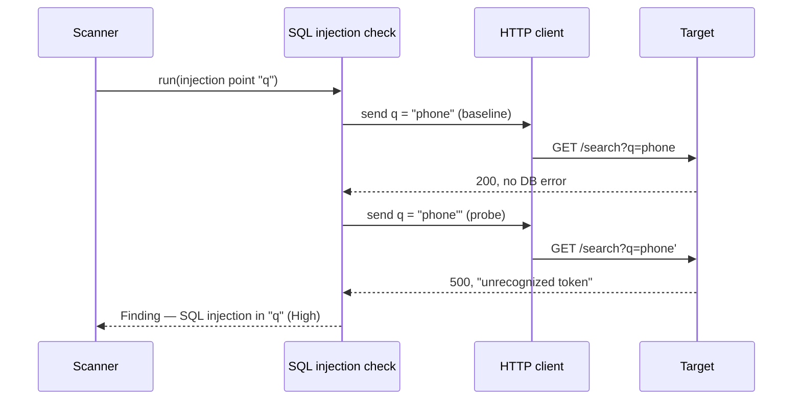
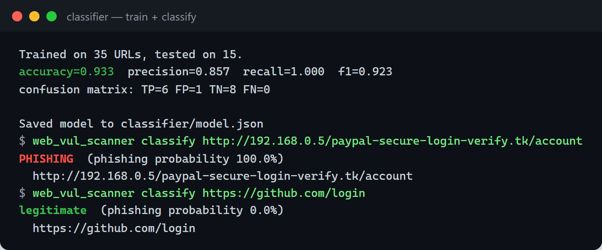
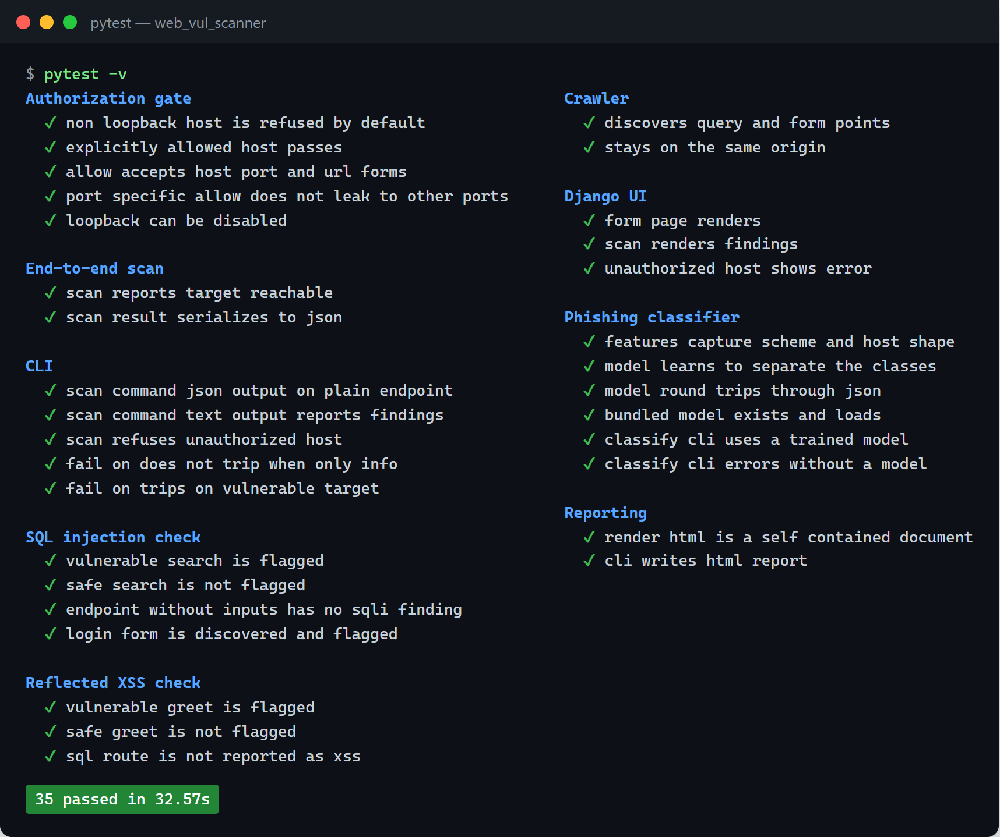

<div align="center">

# web_vul_scanner

**An educational web vulnerability scanner** — crawls a target web app, probes
its inputs for **SQL injection** and **reflected XSS**, and reports findings
with remediation. Ships a separate, offline **Naive Bayes phishing-URL
classifier**. CLI, Django UI, and HTML/JSON reports.

[](https://github.com/ahanya-mohan/web_vul_scanner/actions/workflows/ci.yml)


</div>

> ⚠️ **Authorized use only.** This tool sends test requests to web applications.
> Only run it against systems you own or have explicit written permission to
> test. Non-loopback hosts are refused unless you authorize them with `--allow`.
> A deliberately vulnerable practice target is bundled so everything here runs
> safely on your own machine. See [SECURITY.md](SECURITY.md).



## Contents

1. [What it does](#what-it-does)
2. [Screenshots](#screenshots)
3. [Architecture](#architecture)
4. [Vulnerability checks](#vulnerability-checks)
5. [Phishing-URL classifier](#phishing-url-classifier)
6. [Testing and CI](#testing-and-ci)
7. [Getting started](#getting-started)
8. [Project structure](#project-structure)
9. [License](#license)

## What it does

Two independent capabilities:

**1. Active vulnerability scanner.** Give it a URL. It crawls the same-origin
pages, discovers every query parameter and form field, and probes each one:

- **SQL injection** — injects a quote and detects a database error that the
  benign request did not produce.
- **Reflected XSS** — submits a uniquely tagged HTML marker and detects it
  reflected back unescaped.
- **Reachability** — a baseline probe that records status and server banner.

Findings roll up into one report (text, JSON, or a standalone HTML file), each
with severity and remediation advice.

**2. Phishing-URL classifier.** A Gaussian Naive Bayes model — implemented from
scratch, no ML library — labels a URL as legitimate or phishing from lexical
features of the URL alone. It is fully offline and sends no requests.

**Engineering highlights**

- A pluggable check architecture: a registry means a new vulnerability check is
  one self-contained module.
- An authorization gate every request passes through, plus a throttled,
  timeout-bound HTTP client.
- Naive Bayes written from first principles, with an evaluation harness
  (accuracy / precision / recall / F1).
- **35 tests** — every check proven against the bundled target with a true
  positive *and* a matching no-false-positive case — and a 2-version CI matrix.

## Screenshots

| Web UI — completed scan | Standalone HTML report |
| --- | --- |
|  |  |

## Architecture

One throttled, authorized HTTP client sits under everything. The scanner crawls
the target into a set of injection points, runs every registered check against
them, and rolls the findings into one report. The phishing classifier is a
separate, offline path.



**How a check works** — every check follows the same shape: compare a benign
request against a crafted one.



### Modules

| Area | Module |
| --- | --- |
| Authorization gate | `core/authorization.py` |
| HTTP client (throttle, timeout) | `core/http_client.py` |
| Injection points | `core/injection.py` |
| Crawler (link + form discovery) | `core/crawler.py` |
| Check interface + registry | `checks/base.py` |
| Checks | `checks/sql_injection.py`, `checks/xss_injection.py`, `checks/reachability.py` |
| Scan engine | `scanner.py` |
| Report model + rendering | `report/models.py`, `report/render.py` |
| Phishing classifier | `classifier/` |
| Interfaces | `cli.py`, `webui/` (Django) |

### Authorization

The gate is a safeguard, not permission. Loopback (your own machine) is allowed
by default; every other host must be authorized explicitly, and each request is
checked before any traffic is sent.

```bash
web_vul_scanner scan http://127.0.0.1:5000                     # loopback: allowed
web_vul_scanner scan https://staging.example.test              # refused
web_vul_scanner scan https://staging.example.test --allow staging.example.test
```

## Vulnerability checks

| Check | Technique | Severity |
| --- | --- | :---: |
| **SQL injection** | Error-based: inject a single quote and flag a database-error signature that is absent from the baseline response. Conservative by design (needs the error to appear only after injection). | High |
| **Reflected XSS** | Submit a uniquely tokenized HTML marker; flag it if it is reflected verbatim (unescaped) in the response. | High |
| **Reachability** | Baseline GET; records status code and server banner. No payloads. | Info |

Each check is validated both ways: it fires on the vulnerable route (`/search`,
`/greet`, `/login`) and stays silent on the safe equivalent (`/search-safe`,
`/greet-safe`).

## Phishing-URL classifier

A **Gaussian Naive Bayes** classifier written from scratch (`classifier/model.py`)
labels a URL from **13 lexical features** — URL and host length, dot/hyphen
counts, digit ratio, IP-address host, HTTPS, subdomain count, `@` in the URL,
and phishing-favoured tokens. It sends no requests.



```bash
web_vul_scanner classify "http://192.168.0.5/paypal-secure-login.tk/verify"
# PHISHING  (phishing probability 100.0%)

web_vul_scanner classify "https://github.com/login"
# legitimate  (phishing probability 0.0%)   ← the "login" token alone doesn't fool it
```

Retrain and evaluate (metrics on a held-out split):

```bash
python -m web_vul_scanner.classifier.train
python -m web_vul_scanner.classifier.evaluate
```

The bundled dataset is small and synthetic — a demonstration of the pipeline,
not a benchmark. See [`data/README.md`](data/README.md) and
[`web_vul_scanner/classifier/README.md`](web_vul_scanner/classifier/README.md).

## Testing and CI

35 tests: unit tests for the scorer, features and authorization gate, plus
feature tests that drive real HTTP against the bundled target. Every check has a
true-positive and a no-false-positive case.



CI (GitHub Actions) lints with **ruff** and runs the suite on **Python 3.10 and
3.12**, then trains and evaluates the classifier.

## Getting started

### Requirements

Python 3.10+.

### Setup

```bash
git clone https://github.com/ahanya-mohan/web_vul_scanner.git
cd web_vul_scanner
python -m venv .venv && . .venv/bin/activate      # Windows: .venv\Scripts\activate
pip install -e ".[dev]"
```

### Scan the bundled target

```bash
python -m targets.vulnerable_app.app               # serves http://127.0.0.1:5000
web_vul_scanner scan http://127.0.0.1:5000                       # text report
web_vul_scanner scan http://127.0.0.1:5000 --format html --output report.html
```

### Web UI

```bash
python webui/manage.py runserver                   # http://127.0.0.1:8000
```

### Docker target

```bash
docker compose up --build                          # target on http://127.0.0.1:5000
```

## Project structure

```
web_vul_scanner/
├── web_vul_scanner/            the library
│   ├── core/                   authorization, http client, injection points, crawler
│   ├── checks/                 base + registry, sql_injection, xss_injection, reachability
│   ├── classifier/             features, Naive Bayes model, train/evaluate, model.json
│   ├── report/                 models + text/JSON/HTML rendering
│   ├── scanner.py              crawl → run checks → collect findings
│   └── cli.py                  scan / classify
├── webui/                      Django UI over the library
├── targets/vulnerable_app/     bundled, intentionally vulnerable target
├── data/                       labelled URL dataset for the classifier
├── tests/                      unit + HTTP feature tests
├── docker/ · docker-compose.yml
└── .github/workflows/ci.yml    ruff + pytest (3.10, 3.12) + classifier
```

## License

[MIT](LICENSE)
