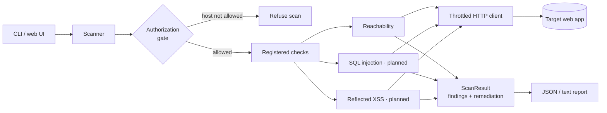

<div align="center">

# web_vul_scanner

**An educational web vulnerability scanner** — probes a target web application
for common vulnerability classes (SQL injection, reflected XSS) and classifies
suspicious URLs, then reports findings with remediation advice.


</div>

> ⚠️ **Authorized use only.** This tool sends test requests to web applications.
> Only run it against systems you own or have explicit written permission to
> test. It refuses any non-loopback host unless you authorize it with `--allow`.
> See [SECURITY.md](SECURITY.md). A deliberately vulnerable practice target is
> bundled so you can try everything safely on your own machine.

## Status

Early development, built in vertical slices — each slice is a working,
end-to-end feature with tests green in CI.

| Slice | Feature | State |
| :---: | --- | :---: |
| 0 | Engine skeleton: authorization gate, throttled HTTP client, check registry, reporting, CLI, bundled target | ✅ done |
| 1 | SQL injection check | ▫ planned |
| 2 | Reflected XSS check | ▫ planned |
| 3 | Crawler (form / parameter discovery) | ▫ planned |
| 4 | Django web UI | ▫ planned |
| 5 | Phishing-URL classifier (Naive Bayes) | ▫ planned |
| 6 | HTML report and severity polish | ▫ planned |

## Architecture

Every request flows through one throttled, authorized HTTP client. Checks are
self-contained probes discovered from a registry, so adding a capability is one
new module. Findings from every check roll up into a single report.



## Quickstart

```bash
git clone https://github.com/ahanya-mohan/web_vul_scanner.git
cd web_vul_scanner
python -m venv .venv && . .venv/bin/activate      # Windows: .venv\Scripts\activate
pip install -e ".[dev]"
```

Start the bundled practice target, then scan it:

```bash
python -m targets.vulnerable_app.app               # serves http://127.0.0.1:5000
web_vul_scanner scan http://127.0.0.1:5000
```

```text
Scan of http://127.0.0.1:5000
  findings: 1  highest: Info

[INFO] Target reachable
    url:      http://127.0.0.1:5000
    evidence: HTTP 200, Server: Werkzeug/3.1.8 Python/3.14.7
```

`--json` prints a machine-readable report; `--fail-on high` makes the process
exit non-zero when a finding of that severity or higher is present (useful in
CI). To scan a host that isn't loopback, authorize it explicitly:

```bash
web_vul_scanner scan https://staging.example.test --allow staging.example.test
```

Or run the target in Docker:

```bash
docker compose up --build            # target on http://127.0.0.1:5000
```

## Project layout

```
web_vul_scanner/
├── web_vul_scanner/            the scanner package
│   ├── core/
│   │   ├── authorization.py    allowlist gate — refuses unauthorized hosts
│   │   └── http_client.py      throttled, timeout-bound HTTP session
│   ├── checks/
│   │   ├── base.py             Check interface + registry
│   │   └── reachability.py     baseline check (template for real checks)
│   ├── report/
│   │   ├── models.py           Finding, Severity, ScanResult
│   │   └── render.py           text report
│   ├── scanner.py              runs every registered check against a target
│   └── cli.py                  `web_vul_scanner scan <url>`
├── targets/vulnerable_app/     bundled, intentionally vulnerable target
├── tests/                      authorization, end-to-end scan, CLI
└── .github/workflows/ci.yml    lint + test on Python 3.10 and 3.12
```

## Development

```bash
pytest -q          # tests (starts the bundled target automatically)
ruff check .       # lint
```

## License

[MIT](LICENSE)
